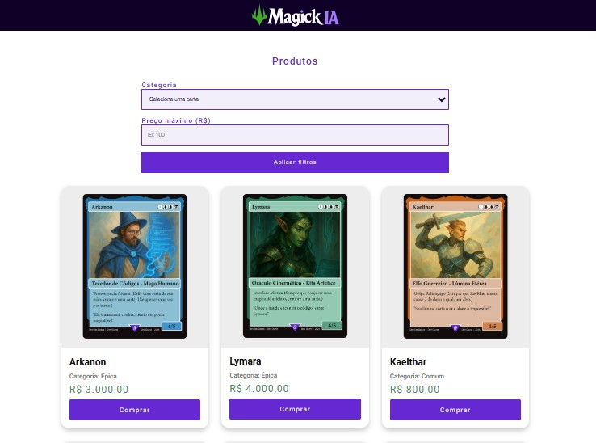
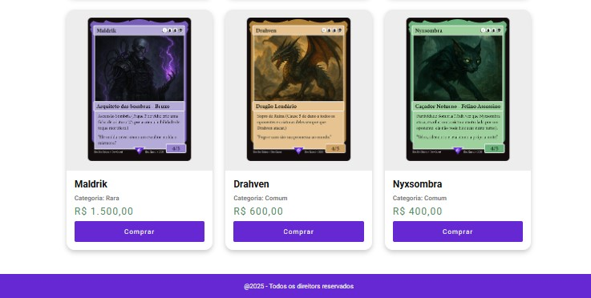

<h1 align="center"> MagickIA </h1>

Semana do 0 ao Programador Contratado, evento exclusivo e gratuito, promovido pelo Dev em Dobro, para ensino de tecnologias Web Front-end.

## 🚀 Tecnologias

Esse projeto foi desenvolvido com as seguintes tecnologias:

- HTML
- CSS
- JavaScript

## 💻 Projeto

E-commerce de cartinhas inspiradas no jogo Magic, com ferramentas como filtros de categoria e preço.

<a href="https://kethillen.github.io/magickIA/" target="_blank">Veja o projeto aqui</a> 

Feito com ♥ by K.Dev

